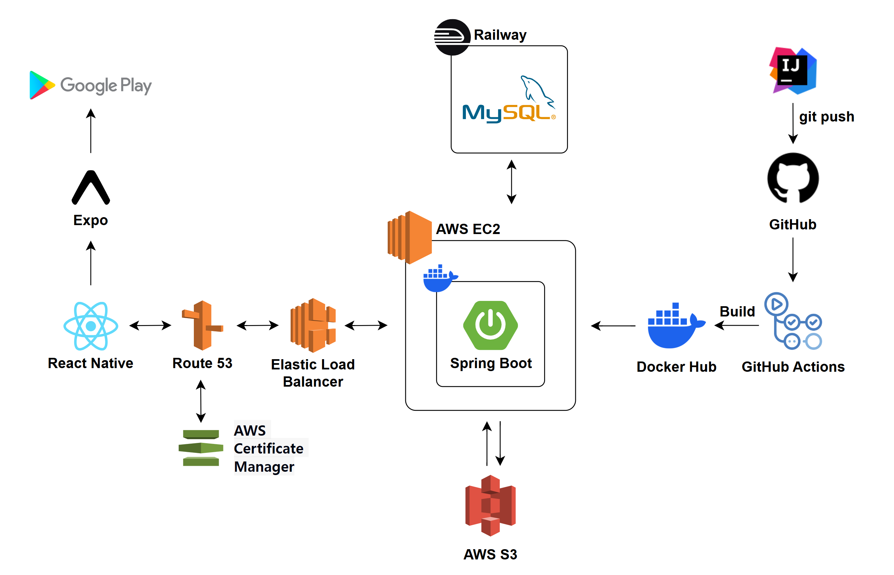
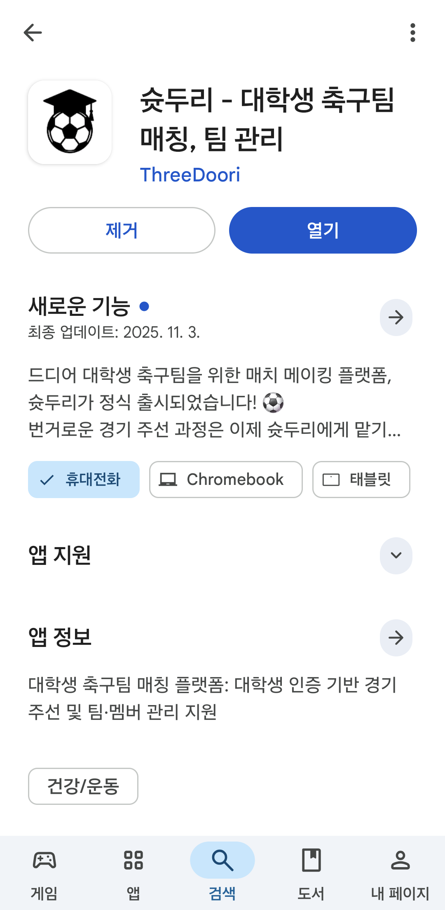

# Shoot Doori FE ⚽

## 🚀 시작하기

**혼자가 아닌 함께, 실력 맞춤 지역 스포츠 매칭 플랫폼**

> 개인 실력과 지역 기반으로 축구 팀 매칭을 도와주는 서비스입니다.  
> 혼자서도, 친구와 함께도 쉽게 경기를 즐길 수 있도록 설계되었습니다.

---

## 👥 프로젝트 팀원

|                                                           Frontend                                                            |                                                              Frontend                                                               |                                                              Backend                                                              |                                                               Backend                                                               |                                                                Backend                                                                |                                                             Backend                                                             |
| :---------------------------------------------------------------------------------------------------------------------------: | :---------------------------------------------------------------------------------------------------------------------------------: | :-------------------------------------------------------------------------------------------------------------------------------: | :---------------------------------------------------------------------------------------------------------------------------------: | :-----------------------------------------------------------------------------------------------------------------------------------: | :-----------------------------------------------------------------------------------------------------------------------------: |
|  <br> **[설유준](https://github.com/cheog0)** |  <br> **[김지수](https://github.com/jskim3936)** |  <br> **[김상수](https://github.com/raminkim)** |  <br> **[선원준](https://github.com/ManDu2001)** |  <br> **[이시행](https://github.com/sweet-mine)** |  <br> **[서현주](https://github.com/KKPASII)** |

## 🎬 시연 영상


---

## 🛠 기술 스택

### 💻 Language & Framework


---

### ⚙️ State & Data Management


---

### 🎨 UI & Styling


---

### 🧩 Navigation & UI Interaction


---

### 🗄️ Mock API & Local DB


---

### 🚀 Development & Automation


---

### 🧠 기타 주요 라이브러리


---

### 🔧 Tools & Environment


---

📘 **구성 요약**  
이 프로젝트는 **Expo SDK 54 + React Native 0.81 + React 19 + TypeScript** 기반으로,  
`expo-router`를 이용한 화면 구조화, `React Query + Zustand`를 통한 상태 관리,  
`JSON Server`를 통한 로컬 Mock API, 그리고 **Husky + Lint-Staged** 기반 자동 포맷팅 환경을 갖추고 있습니다.

---

## 📁 프로젝트 구조

```

Team3_FE/
├── app/                        # Expo Router 기반 라우팅 폴더
│   ├── _layout.tsx             # 전역 네비게이션 및 Stack 구조 정의
│   ├── (auth)/                 # 로그인, 회원가입 등 인증 관련 화면 그룹
│   └── (tabs)/                 # 하단 탭 내 주요 화면 그룹 (홈, 팀, 경기 등)
│
├── src/
│   ├── api/                    # Axios를 통한 백엔드 API 요청 모듈
│   ├── components/             # 공용 UI 컴포넌트 (헤더, 버튼, 모달 등)
│   ├── constants/              # 라우트, 엔드 포인트, 색상 등 전역 상수
│   ├── contexts/               # Context API (Auth, User 등 전역 상태)
│   ├── hooks/                  # React Query 기반 데이터 fetching hooks
│   ├── lib/                    # queryClient, axios 인스턴스 등 공용 설정
│   ├── screens/                # 주요 화면 (팀 관리, 경기 신청, 프로필 등)
│   ├── theme/                  # 색상, 폰트, spacing 등 스타일 시스템
│   └── utils/                  # 날짜 포맷, 포지션 변환 등 유틸 함수


```

---

## 📅 개발 일정

<table border="1" cellpadding="10" cellspacing="0" style="border-collapse: collapse; width: 100%;">
<thead>
<tr>
<th style="text-align:center; border: 1px solid #ddd;">주차</th>
<th style="text-align:center; border: 1px solid #ddd;">기간</th>
<th style="text-align:center; border: 1px solid #ddd;">주요 주제</th>
<th style="text-align:center; border: 1px solid #ddd;">상세 내용</th>
<th style="text-align:center; border: 1px solid #ddd;">목표 달성</th>
</tr>
</thead>
<tbody>
<tr>
<td style="text-align:center; border: 1px solid #ddd;"><strong>1주차</strong></td>
<td style="text-align:center; border: 1px solid #ddd;">2025.08.04 ~ 2025.08.10</td>
<td style="text-align:center; border: 1px solid #ddd;">🧠 서비스 기획 및 아이디어톤 진행</td>
<td style="border: 1px solid #ddd;">- 서비스 콘셉트 구체화 및 핵심 타깃 정의<br>- 프로젝트 주제 및 기능 초안 구상</td>
<td style="text-align:center; border: 1px solid #ddd;">✅ 초기 기획 완료</td>
</tr>
<tr>
<td style="text-align:center; border: 1px solid #ddd;"><strong>2주차</strong></td>
<td style="text-align:center; border: 1px solid #ddd;">2025.08.11 ~ 2025.08.17</td>
<td style="text-align:center; border: 1px solid #ddd;">🧩 서비스 기획안 고도화 및 UI 설계</td>
<td style="border: 1px solid #ddd;">- 사용자 흐름 정의 (회원 → 팀 → 매칭 프로세스)<br>- 기술 스택 확정 및 UI 와이어프레임 초안 작성</td>
<td style="text-align:center; border: 1px solid #ddd;">✅ 서비스 흐름 정의 및 UI 초안 설계</td>
</tr>
<tr>
<td style="text-align:center; border: 1px solid #ddd;"><strong>3주차</strong></td>
<td style="text-align:center; border: 1px solid #ddd;">2025.08.18 ~ 2025.08.24</td>
<td style="text-align:center; border: 1px solid #ddd;">📄 최종 기획안·테크스펙 작성</td>
<td style="border: 1px solid #ddd;">- 프론트엔드 구조 설계 문서화<br>- UI 와이어프레임 고도화</td>
<td style="text-align:center; border: 1px solid #ddd;">✅ 테크스펙 및 UI 설계 완료</td>
</tr>
<tr>
<td style="text-align:center; border: 1px solid #ddd;"><strong>4주차</strong></td>
<td style="text-align:center; border: 1px solid #ddd;">2025.08.25 ~ 2025.08.31</td>
<td style="text-align:center; border: 1px solid #ddd;">🏗 깃허브 환경 셋업 및 개발 환경 구축</td>
<td style="border: 1px solid #ddd;">- 레포 초기 세팅, 브랜치 전략 확립<br>- 개발환경 셋팅 및 패키지 구조 설계 완료</td>
<td style="text-align:center; border: 1px solid #ddd;">✅ 개발 환경 구축 및 브랜치 전략 정립</td>
</tr>
<tr>
<td style="text-align:center; border: 1px solid #ddd;"><strong>5주차</strong></td>
<td style="text-align:center; border: 1px solid #ddd;">2025.09.01 ~ 2025.09.07</td>
<td style="text-align:center; border: 1px solid #ddd;">⚙️ 프로필 페이지 UI 구현</td>
<td style="border: 1px solid #ddd;">- Profile 페이지 UI 구현<br>- Tanstack Query 기반 데이터 구조 설정<br>- 공통 UI 컴포넌트 구현<br>- 프로필 스크린 route 설정</td>
<td style="text-align:center; border: 1px solid #ddd;">✅ 프로필 페이지 구현 및 초기 셋팅</td>
</tr>
<tr>
<td style="text-align:center; border: 1px solid #ddd;"><strong>6주차</strong></td>
<td style="text-align:center; border: 1px solid #ddd;">2025.09.08 ~ 2025.09.14</td>
<td style="text-align:center; border: 1px solid #ddd;">🤝 메인 페이지 UI 구현</td>
<td style="border: 1px solid #ddd;">- 메인 페이지 UI 구현<br>- 메인 페이지 router 추가<br>- 컴포넌트 분리 리팩토링</td>
<td style="text-align:center; border: 1px solid #ddd;">✅ 메인 페이지 구현 및 컴포넌트 분리 확장</td>
</tr>
<tr>
<td style="text-align:center; border: 1px solid #ddd;"><strong>7주차</strong></td>
<td style="text-align:center; border: 1px solid #ddd;">2025.09.15 ~ 2025.09.21</td>
<td style="text-align:center; border: 1px solid #ddd;">🔐 팀 페이지 UI 및 API 연동</td>
<td style="border: 1px solid #ddd;">- 팀 페이지 UI 구현<br>- 공통 유틸리티 및 UI 컴포넌트 추가<br>- 팀 관리 API 연동</td>
<td style="text-align:center; border: 1px solid #ddd;">✅ 팀 페이지 UI 및 API 연동 완료</td>
</tr>
<tr>
<td style="text-align:center; border: 1px solid #ddd;"><strong>8주차</strong></td>
<td style="text-align:center; border: 1px solid #ddd;">2025.09.22 ~ 2025.09.28</td>
<td style="text-align:center; border: 1px solid #ddd;">🧪 로그인 페이지 UI 및 API 연동</td>
<td style="border: 1px solid #ddd;">- 단계별 회원가입 화면 구현<br>- 폼 상태 관리 개선 및 유효성 검사 로직 분리<br>- 회원가입 API 및 타입 정의 업데이트<br>- CI/CD 파이프라인 구축</td>
<td style="text-align:center; border: 1px solid #ddd;">✅ 로그인 페이지 및 CI/CD 구축 완료</td>
</tr>
<tr>
<td style="text-align:center; border: 1px solid #ddd;"><strong>9주차</strong></td>
<td style="text-align:center; border: 1px solid #ddd;">2025.09.29 ~ 2025.10.05</td>
<td style="text-align:center; border: 1px solid #ddd;">🚀 매치 생성 UI 및 API 연동</td>
<td style="border: 1px solid #ddd;">- 매치 생성 UI 및 경기장 정보 API 연동<br>- 매치 대기 목록 조회 API 수정<br>- 로그아웃 및 팀-멤버 연동 API 추가</td>
<td style="text-align:center; border: 1px solid #ddd;">✅ 매치 생성 UI 및 API 연동 완료</td>
</tr>
<tr>
<td style="text-align:center; border: 1px solid #ddd;"><strong>10주차</strong></td>
<td style="text-align:center; border: 1px solid #ddd;">2025.10.06 ~ 2025.10.12</td>
<td style="text-align:center; border: 1px solid #ddd;">🧰 매치 조회 및 요청 기능 구현</td>
<td style="border: 1px solid #ddd;">- 생성한 매치 조회 및 요청 화면 구현<br>- 비밀번호 찾기 및 변경 기능 개선<br>- Suspense 기반 인증 상태 관리<br>- API 클라이언트 개선</td>
<td style="text-align:center; border: 1px solid #ddd;">✅ 매치 조회 UI 및 리팩토링 완료</td>
</tr>
<tr>
<td style="text-align:center; border: 1px solid #ddd;"><strong>11주차</strong></td>
<td style="text-align:center; border: 1px solid #ddd;">2025.10.13 ~ 2025.10.19</td>
<td style="text-align:center; border: 1px solid #ddd;">🧠 실사용 피드백 반영</td>
<td style="border: 1px solid #ddd;">- 시간 불일치 문제 해결<br>- UI 개선<br>- 대학교 이메일 통합<br>- 코드 정리 및 일관성 관리</td>
<td style="text-align:center; border: 1px solid #ddd;">✅ 피드백 수용 및 코드 품질 개선</td>
</tr>
<tr>
<td style="text-align:center; border: 1px solid #ddd;"><strong>12주차</strong></td>
<td style="text-align:center; border: 1px solid #ddd;">2025.10.20 ~ 2025.10.26</td>
<td style="text-align:center; border: 1px solid #ddd;">🧩 용병 서비스 화면 구현</td>
<td style="border: 1px solid #ddd;">- 용병 모집 페이지 UI 구현<br>- 용병 API 연동<br>- 포지션 옵션 확장</td>
<td style="text-align:center; border: 1px solid #ddd;">✅ 용병 서비스 구현 완료</td>
</tr>
<tr>
<td style="text-align:center; border: 1px solid #ddd;"><strong>13주차</strong></td>
<td style="text-align:center; border: 1px solid #ddd;">2025.10.27 ~ 2025.11.02</td>
<td style="text-align:center; border: 1px solid #ddd;">⚡ 리뷰 서비스 화면 구현</td>
<td style="border: 1px solid #ddd;">- 리뷰 작성 및 조회 컴포넌트 구현<br>- 팀원 조회 페이징 및 용병 역할 표기<br>- 상태 배지 및 정보 행 공용화</td>
<td style="text-align:center; border: 1px solid #ddd;">✅ 리뷰 서비스 구현 완료</td>
</tr>
<tr>
<td style="text-align:center; border: 1px solid #ddd;"><strong>14주차</strong></td>
<td style="text-align:center; border: 1px solid #ddd;">2025.11.03 ~ 2025.11.09</td>
<td style="text-align:center; border: 1px solid #ddd;">🧾 라인업 화면 구현 및 마무리</td>
<td style="border: 1px solid #ddd;">- 라인업 화면 UI 및 API 연동<br>- 오늘의 매치 목록 상태 조회 로직 단순화<br>- 전체 API 검증 및 버그 픽스<br>- 최종 발표 준비</td>
<td style="text-align:center; border: 1px solid #ddd;">✅ 최종 배포 및 안정화 완료</td>
</tr>
</tbody>
</table>

---

## 🧩 서비스 아키텍처



---

## 📱 앱 다운로드

[](https://play.google.com/store/apps)

👉 **[앱 다운로드하기](https://play.google.com/store/apps/details?id=com.cheogo.shootdoori&hl=ko)**


